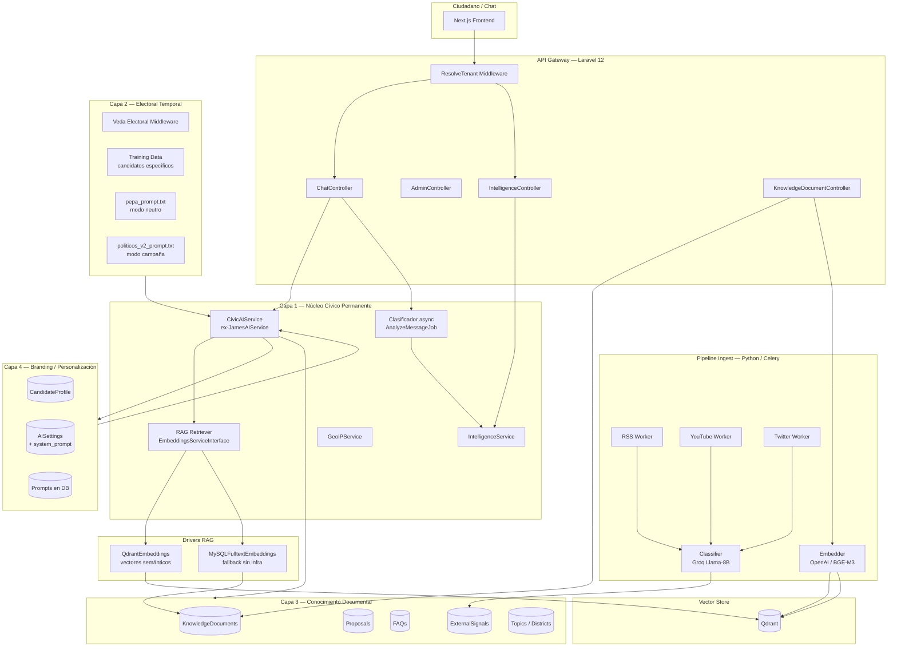

# 03 — Arquitectura Objetivo: PEPA

> Estado: diseño aprobado pendiente. No implementar hasta aprobar el roadmap (04).

---

## 1. Diagrama lógico de capas



---

## 2. Definición de cada capa

### Capa 1 — Núcleo Cívico Permanente (`/services`, `/rag`, `/agents`)

**Invariante**: no sabe quién es el candidato. Recibe contexto inyectado, no lo hardcodea.

| Componente | Responsabilidad | Input | Output |
|-----------|----------------|-------|--------|
| `CivicAIService` | Orquestación: sanitización → detección → RAG → prompt → LLM → parse | Mensaje usuario + sesión | `{reply, topic, media, pepa_metadata}` |
| `EmbeddingsServiceInterface` | Contrato RAG abstracto | Query + filtros | Documentos rankeados |
| `QdrantEmbeddings` | RAG semántico via vector store | Query texto | Top-K chunks con score |
| `MySQLFulltextEmbeddings` | RAG FULLTEXT, sin infra extra | Query texto | Top-K docs con relevance |
| `IntelligenceService` | Pulso ciudadano, ataques, alertas | — (consulta DB) | Métricas agregadas |
| `AnalyzeMessageJob` | Clasificación async post-chat | Mensaje texto | `{sentiment, emotion, intent, concerns}` |
| `GeolocateSessionJob` | Geolocalización por IP | IP string | `{region, city, lat, lng}` |
| `ClusterTopQuestionsJob` | Agrupación de preguntas similares | ChatMessages recientes | QuestionClusters |
| `GenerateAlertsJob` | Detección de anomalías | DB métricas | IntelAlerts |

**Regla de aislamiento**: ningún archivo de esta capa importa `CandidateProfile` directamente — lo recibe como parámetro o lo lee de la sesión. La excepción actual en `JamesAIService::__construct()` (línea 45) es el principal punto de refactoring.

---

### Capa 2 — Electoral Temporal (`/electoral`, `/training-data`)

**Invariante**: código que tiene fecha de expiración electoral. Se activa/desactiva por ciclo.

| Componente | Descripción | Lifecycle |
|-----------|-------------|-----------|
| `KeikoSeeder` / `RobertoSanchezSeeder` | Carga completa de un candidato al DB | Una vez por tenant, antes del lanzamiento |
| Veda Electoral Middleware | Bloquea el chat 24h antes y durante las elecciones | Activar el 6 jun 2026 00:00 ART → desactivar el 9 jun |
| `campaign_slogan`, `signature_phrases`, `forbidden_topics` | Campos de campaña en `CandidateProfile` | Por ciclo electoral |
| `training-data/` | Repositorio de seeders de candidatos | Histórico, nunca borrar |

---

### Capa 3 — Conocimiento Documental (`/knowledge`, `/datasets`)

**Invariante**: datos ingestados dinámicamente. Ningún texto de candidato va hardcodeado en código.

| Entidad | Cómo entra | Cómo se usa |
|---------|-----------|-------------|
| `KnowledgeDocument` | Admin sube PDF/texto → extrae contenido → indexa en RAG | RAG retrieval en cada chat |
| `Proposal` | Admin CRUD o seeder de candidato | RAG contextual por tema/distrito |
| `Faq` | Admin CRUD o seeder de candidato | RAG contextual por tema |
| `ExternalSignal` | Ingest Python (RSS, YouTube, Twitter) | Inteligencia electoral |
| `Topic` / `District` | Seeder genérico → extensible por admin | Detección semántica en mensajes |
| `AttackResponse` | Admin CRUD o seeder de candidato | Detección de ataques + respuesta plantilla |

**Para PEPA**: en modo multi-candidato, cada `KnowledgeDocument` lleva un campo `candidate_id` (hoy tiene `topic`). El RAG filtra por todos los candidatos del tenant y devuelve con atribución de fuente.

---

### Capa 4 — Branding / Personalización (`/branding`)

**Invariante**: configurable desde el panel admin, sin tocar código. Todo en BD.

| Configuración | Modelo DB | Editable desde |
|--------------|-----------|----------------|
| Nombre, partido, cargo, slogan | `CandidateProfile` | `/admin/candidate-profile` |
| Tono, frases firma, temas prohibidos | `CandidateProfile.personality_traits` | `/admin/candidate-profile` |
| System prompt (template + placeholders) | `AiSetting.system_prompt` | `/admin/ai-settings` |
| Modelo AI, temperatura, max_tokens | `AiSetting` | `/admin/ai-settings` |
| Landing: hero, colores, videos | `HeroSetting`, `Setting` | `/admin/hero-settings` |

---

## 3. Contratos entre capas

```
Branding → Núcleo:
  CandidateProfile { name, party, title, personality_traits, biography_long,
                     signature_phrases, forbidden_topics, attack_response_style }
  AiSetting { system_prompt (template), provider, model, temperature, max_tokens }

Conocimiento → Núcleo:
  EmbeddingsService.search(query, topK, filters) → [{title, excerpt, score, metadata}]
  Proposal.byTopicAndDistrict(topic, district) → Proposal[]
  Faq.byTopic(topic) → Faq[]
  AttackResponse.detectionMap() → [{keywords, template, deflection_topic, priority}]

Núcleo → LLMs:
  POST /v1/messages (Claude) | /v1/chat/completions (OpenAI/Groq)
  Input: {system_prompt, messages[], model, temperature, max_tokens}
  Output: texto plano | JSON estructurado {respuesta_usuario, metadata_interna}

Ingest → Conocimiento:
  POST /api/admin/external-signals/ingest
  Input: {signals: [{source, content, sentiment, is_attack, topic, ...}]}

Núcleo → Frontend:
  {reply: string, topic: string|null, media: MediaItem[], pepa_metadata: object|null,
   attack_detected: bool, attack_category: string|null}
```

---

## 4. Patrón multi-tenant documental

**Cómo agregar un candidato nuevo sin tocar código:**

```
1. SuperAdmin crea tenant
   POST /api/superadmin/tenants
   { slug: "nuevo_candidato", name: "...", db_name: "tenant_nuevo", ... }

2. Migrations en la nueva DB
   php artisan migrate --database=tenant_nuevo

3. Seeder base (temas genéricos, settings IA)
   php artisan db:seed --class=DatabaseSeederV2 --database=tenant_nuevo

4. Configurar candidato desde admin
   PUT /api/admin/candidate-profile  (nombre, partido, bio, personalidad)
   PUT /api/admin/ai-settings        (prompt, modelo)

5. Cargar documentos
   POST /api/admin/knowledge  (PDFs: plan de gobierno, declaraciones, HV)
   POST /api/admin/knowledge/{id}/reindex  (indexar en RAG)

6. Opcional: seeders de candidato específico
   php artisan db:seed --class=NuevoCandidatoSeeder --database=tenant_nuevo
   (este seeder vive en /training-data/nuevo_candidato/)

7. El chat ya funciona con los documentos cargados
   El RAG recupera fragmentos del plan de gobierno real
   No hay ningún texto hardcodeado en código
```

---

## 5. Modelo de trazabilidad de fuentes (PEPA)

Cada respuesta de PEPA incluye `pepa_metadata.fuentes_citadas[]`. El flujo es:

```
1. RAG retorna chunks con {document_id, title, excerpt, score}
2. buildContext() incluye el texto del chunk en el contexto al LLM
3. El LLM, entrenado con pepa_prompt.txt regla #1, cita la fuente en su respuesta
4. parseAIResponse() extrae fuentes_citadas[] del JSON metadata_interna
5. mediaFromSources() valida URLs y las devuelve como links al frontend
6. El frontend renderiza badge "Fuente verificada: [título del doc]"
7. La auditoría: KnowledgeDocument.id + chunk_index en embeddings_meta
```

**Gap actual**: `KnowledgeDocument` no tiene campo `source_url` (URL original del JNE o medio). Para PEPA completo se necesita agregar ese campo y propagarlo al payload del chunk en Qdrant.

---

## 6. Modos de operación

| Modo | Prompt activo | Perfil | RAG | Descripción |
|------|--------------|--------|-----|-------------|
| **PEPA neutro** | `pepa_prompt.txt` | — (sin candidato activo) | Multi-candidato (todos los docs del tenant) | Compara propuestas, cita JNE, no defiende |
| **Campaña (SaaS)** | `politicos_v2_prompt.txt` | CandidateProfile del tenant | Single-candidato (docs de ese candidato) | Habla en primera persona por el candidato |
| **Híbrido** | `pepa_prompt.txt` + `{{candidatos}}` | Nombre del candidato | Docs del candidato | PEPA que conoce a un candidato específico sin defenderlo |

El modo se selecciona en `AiSetting.system_prompt`. El admin elige qué template cargar.

---

## Open Questions

1. ¿PEPA multi-candidato necesita una DB por candidato (multi-tenant actual) o una sola DB con `candidate_id` en cada tabla de documentos?
2. ¿Cómo se autentican los tenants de candidatos que comparten el mismo Qdrant? La colección ya usa `politicos_{slug}_docs` — eso sirve como aislamiento.
3. ¿Quién valida que un documento cargado sea "verificable"? ¿Un flujo de aprobación o se carga directo?
4. ¿`ExternalSignal` se comparte entre candidatos (señales del ecosistema) o es por tenant?
